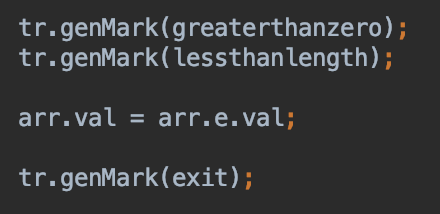
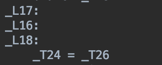

# Decaf PA 3

王世因	2016011246

### Runtime Error 添加被除数是0的报错

* 修改文件 error/RuntimeError.java

```java
public static final String DIVIDE_BY_ZERO = "Decaf runtime error: Division by zero error.\n";
```

* 修改文件 translate/TransPass2.java 中的visitBinary

在第二遍遍历的时候，我们计算出了各表达式的值，在此基础上进行是否为0的判断

```java
case Tree.DIV:
    tr.genCheckNZero(expr.right.val);
    expr.val = tr.genDiv(expr.left.val, expr.right.val);
    break;
case Tree.MOD:
    tr.genCheckNZero(expr.right.val);
    expr.val = tr.genMod(expr.left.val, expr.right.val);
    break;
```

* 修改文件 translate/Translator.java

仿照其他的比较大小的函数，我定义了判断是否为0的函数

```java
public void genCheckNZero(Temp size){
    Label exit = Label.createLabel();
    Temp cond = genEqu(size, genLoadImm4(0));
    genBeqz(cond, exit);
    Temp msg = genLoadStrConst(RuntimeError.DIVIDE_BY_ZERO);
    genParm(msg);
    genIntrinsicCall(Intrinsic.PRINT_STRING);
    genIntrinsicCall(Intrinsic.HALT);
    genMark(exit);
}
```

### Scopy 浅复制

* 修改文件 translate/TransPass2.java

```java
@Override
public void visitScopy(Tree.Scopy scopy) {
    scopy.expr.accept(this);
    int width = ((ClassType)(scopy.expr.type)).getSymbol().getSize();
    Temp dstAddr = tr.genDirectCall(((ClassType)(scopy.expr.type)).getSymbol().getNewFuncLabel(), BaseType.INT);
    for (int i = 0; i < width; i += 4) {
        tr.genStore(tr.genLoad(scopy.expr.val, i), dstAddr, i);
    }
    scopy.symbol.setTemp(dstAddr);
}
```

* 修改文件 tree/tree.java：增加`Variable symbol`属性
* 修改文件 typecheck/TypeCheck.java：在检查类型的时候记录上`Variable symbol`对应的变量

### Guard条件卫士

* 修改文件 translate/TransPass2.java

```java
@Override
public void visitGuard(Tree.Guard guard){
    for (Tree s : guard.block) {
        s.accept(this);
    }
}

@Override
public void visitIfG(Tree.IfG ifStmt){
    ifStmt.condition.accept(this);
    if (ifStmt.trueBranch != null) {
        Label exit = Label.createLabel();
        tr.genBeqz(ifStmt.condition.val, exit);
        if (ifStmt.trueBranch != null) {
            ifStmt.trueBranch.accept(this);
        }
        tr.genMark(exit);
    }
}
```

### var 类型推导

* 修改文件translate/TransPass1.java 定义变量

```java
@Override
public void visitVarAssign(Tree.VarAssign varDef) {
    vars.add(varDef.symbol);
    objectSize += OffsetCounter.WORD_SIZE;
}
```

* 修改文件translate/TransPass2.java 计算类型的值

结合了`visitVarDef`和`visitAssign`两个函数

```java
@Override
public void visitVarAssign(Tree.VarAssign var) {
    var.expr.accept(this);

    if (var.symbol.isLocalVar()) {
        Temp t = Temp.createTempI4();
        t.sym = var.symbol;
        var.symbol.setTemp(t);
    }
    tr.genAssign(((Tree.VarAssign) var).symbol.getTemp(), var.expr.val);
}
```

### Array 数组

#### E%%n 数组初始化常量表达式

和`NewArray`的实现方式很类似，仅改动赋值的那一步并增加新的错误类型即可。

* 修改文件 translate/TransPass2.java

```java
@Override
public void visitArrayInit(Tree.ArrayInit arr){
    arr.e1.accept(this);
    arr.e2.accept(this);
    if(arr.e1.type.equal(BaseType.VAR)){
        issueError(new BadArrElementError(arr.e1.getLocation()));
        arr.type = BaseType.ERROR;
        return;
    }
    else if(!arr.e2.type.equal(BaseType.INT)){
        issueError(new BadArrTimesError(arr.getLocation()));
        arr.type = BaseType.ERROR;
        return;
    }
    arr.elementType = arr.e1.type;
    arr.type = new ArrayType(arr.elementType);
}
```

* 修改文件 translate/Translator.java

```java
public Temp genInitArray(Temp initvar, Temp length) {
    genCheckNewArraySizeInit(length);
    Temp unit = genLoadImm4(OffsetCounter.WORD_SIZE);
    Temp size = genAdd(unit, genMul(unit, length));
    genParm(size);
    Temp obj = genIntrinsicCall(Intrinsic.ALLOCATE);
    genStore(length, obj, 0);
    Label loop = Label.createLabel();
    Label exit = Label.createLabel();
    append(Tac.genAdd(obj, obj, size));
    genMark(loop);
    append(Tac.genSub(size, size, unit));
    genBeqz(size, exit);
    append(Tac.genSub(obj, obj, unit));
    genStore(initvar, obj, 0);
    genBranch(loop);
    genMark(exit);
    return obj;
}
public Temp genInitArrayClass(Temp initvar, Temp length, int width, Class sym){
    Temp unit = genLoadImm4(OffsetCounter.WORD_SIZE);
    Temp size = genAdd(unit, genMul(unit, length));
    genParm(size);
    Temp obj = genIntrinsicCall(Intrinsic.ALLOCATE);
    genStore(length, obj, 0);
    Label loop = Label.createLabel();
    Label exit = Label.createLabel();
    append(Tac.genAdd(obj, obj, size));
    genMark(loop);
    append(Tac.genSub(size, size, unit));
    genBeqz(size, exit);
    append(Tac.genSub(obj, obj, unit));
    Temp dstAddr = genDirectCall(sym.getNewFuncLabel(), BaseType.INT);
    Temp srcAddr =  initvar;
    Temp result = dstAddr;
    for (int i = 0; i < width; i += 4) {
        Temp temp = genLoad(srcAddr, i);
        genStore(temp, dstAddr, i);
    }
    genStore(result, obj, 0);
    genBranch(loop);
    genMark(exit);
    return obj;
}
public void genCheckNewArraySizeInit(Temp size) {
    Label exit = Label.createLabel();
    Temp cond = genLes(size, genLoadImm4(0));
    genBeqz(cond, exit);
    Temp msg = genLoadStrConst(RuntimeError.INIT_ARR_NEG);
    genParm(msg);
    genIntrinsicCall(Intrinsic.PRINT_STRING);
    genIntrinsicCall(Intrinsic.HALT);
    genMark(exit);
}
```

#### default 数组下标动态访问表达式

* 修改文件 translate/TransPass2.java：增加default的类型判别

```java
@Override
public void visitArrayDefault(Tree.ArrayDefault arr){
    Tree.LValue.Slice indexed = (Tree.LValue.Slice) arr.index;
    indexed.array.accept(this);
    indexed.index.accept(this);
    arr.e.accept(this);
    arr.val = tr.genArrayDefault(indexed.array.val, indexed.index.val, arr.e.val);
}
```

* 修改文件 translate/Translater.java：增加default的类型判别

```java
public Temp genArrayDefault(Temp array, Temp index, Temp expr){

    Temp length = genLoad(array, -OffsetCounter.WORD_SIZE);

    //check whether the index of a[x] < length
    Temp cond1 = genLes(index, length);
    Label lessthanlength = Label.createLabel();
    genBeqz(cond1, lessthanlength);

    //check whether the index of a[x] >= 0
    Temp cond2 = genLeq(genLoadImm4(0), index);
    Label greaterthanzero = Label.createLabel();
    genBeqz(cond2, greaterthanzero);

    // return the value of a[x]
    Temp t = genMul(index, genLoadImm4(OffsetCounter.WORD_SIZE));
    Temp base = genAdd(array, t);
    Temp ans = Temp.createTempI4();
    genAssign(ans, genLoad(base, 0));

    Label exit = Label.createLabel();
    genBranch(exit);

    genMark(greaterthanzero);
    genMark(lessthanlength);
    genAssign(ans, expr);
    genMark(exit);

    return ans;
}
```

前面的实现可以直接考模仿已有的代码迅速写出，但是数组这部分的实现就需要读懂其他文件中的代码。比如在实现default的时候，我按照下面左图的方式写，得到了右图的结果。一开始我以为右图中的赋值被放到了下面，但是经过微信群里大家的指点，我发现赋值语句不应该这么写。

#### 

#### foreach 数组迭代语句

* 修改文件 translate/TransPass2.java：增加foreach的类型判别

```java
@Override
public void visitArrayFor(Tree.ArrayFor foreach){
    Variable sym;
    if(foreach.vardef!=null) {
        foreach.vardef.accept(this);
        sym = foreach.vardef.symbol;
    }else{
        Temp t = Temp.createTempI4();
        t.sym = foreach.identvar.symbol;
        foreach.identvar.symbol.setTemp(t);
        sym = foreach.identvar.symbol;
    }
    foreach.array.accept(this);

    // foreach loop
    Temp unit = tr.genLoadImm4(OffsetCounter.WORD_SIZE);
    Temp length = tr.genLoad(foreach.array.val, -OffsetCounter.WORD_SIZE);
    tr.genParm(unit);
    Temp iter = tr.genIntrinsicCall(Intrinsic.ALLOCATE);
    tr.genAssign(iter, foreach.array.val);
    Temp end = tr.genAdd(iter, tr.genMul(length, unit)); //[length][-begin 0][1][2]-end
    Label loop = Label.createLabel();
    Label exit = Label.createLabel();
    tr.genMark(loop);
    
    // inside loop
    Temp loopcond = tr.genLes(iter, end);
    tr.genBeqz(loopcond, exit);
    tr.genAssign(sym.getTemp(), tr.genLoad(iter, 0));
    tr.genAssign(iter, tr.genAdd(iter, unit));
    if(foreach.j!=null){
        foreach.j.accept(this);
        tr.genBeqz(foreach.j.val, exit);  // exit the loop
    }
    loopExits.push(exit);
    foreach.block.accept(this);

    tr.genBranch(loop);
    loopExits.pop();
    tr.genMark(exit);
}
```

需要注意的一点是需要给`iter`新分配内存空间，否则在java的语法中它会被视为`foreach.array.val`的一个指针，对它本身的值造成变化。

### 实验总结和体会

照猫画虎固然可行，但是提前摸清楚算法的原理，可以让我们少走许多弯路，对于实验也有一个高屋建瓴的把控。visitor模式太巧妙了，我体会到了数据结构设计的魅力，这个思想我会好好记住，日后大概率会再用上。

我注意到在Intellij IDE中，编译的时候会进行冲突检查，在继承关系复杂的时候，因为不知道具体的输入是子类还是父类，使用只有子类中有的属性的时候会报错。所以有的时候需要强制类型转化一下。